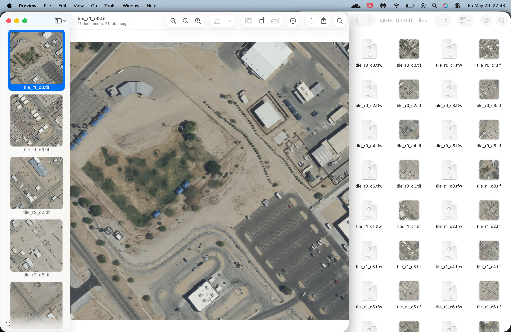
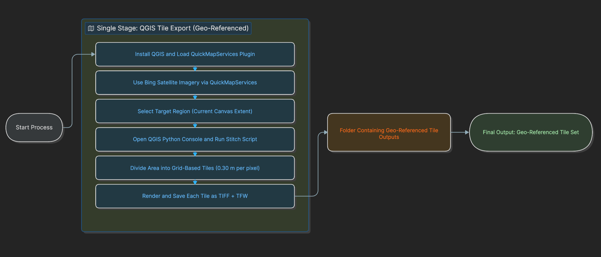

# QGIS Satellite Imagery

This repo contains a QGIS Python script that exports Bing Satellite imagery for a selected area by splitting it into tiles (grid) and generating coordinate-aware outputs.

## Requirements

- QGIS (Desktop)
- QuickMapServices plugin

## Setup

1. Install QGIS.
2. Go to Plugins -> Manage and Install Plugins and install **QuickMapServices**.
3. Add the **Bing Satellite** layer using QuickMapServices.

## Usage

1. Select the working area in QGIS (the current canvas extent is used).
2. Open the QGIS Python Console.
3. Run [scripts/QGIS_stitch_script.py](scripts/QGIS_stitch_script.py).

- This script renders TIFF tiles and creates matching .tfw coordinate files.

## Configuration

Adjustable parameters in the script:

- `OUTPUT_FOLDER`: Output directory
- `TILE_SIZE`: Tile size in pixels. Default: 1024
- `MAP_UNITS_PER_PIXEL`: Output resolution (map units per pixel)

Update these values as needed and re-run the scripts.

## Outputs

- TIFF + TFW (world file with coordinates)
  - Example: `tile_r0_c0.tif`, `tile_r0_c0.tfw`

## Example Output

Example tiles exported by the stitch script at 0.30 meter resolution.

## Flowchart

This flowchart shows the current single-stage workflow: open QGIS, load Bing Satellite through QuickMapServices, select the target canvas extent, run `scripts/QGIS_stitch_script.py`, and export geo-referenced tile outputs as TIFF + TFW files.

## Tips

- Make sure the extent and project CRS are correct.
- Increase `TILE_SIZE` if you want fewer output files.
- Large areas may take a long time depending on network speed.
